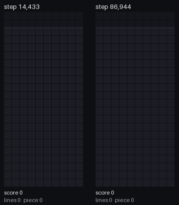

# Tetr

A reinforcement-learning agent that teaches itself Tetris by playing, as
practice for a Slay the Spire 2 agent. The Python engine, a hand-tuned
heuristic baseline, and a small value network trained by self-play (TD
learning) live here; the best learned checkpoint clears ~790 lines per game
on held-out seeds versus ~600 for the tuned heuristic.

## Watching the AI play

Same pieces (seed 10100), early vs late training: step 14,433 (left) and the
best checkpoint, step 86,944 (right). The early agent stacks high with holes;
the trained one keeps a low, flat board and clears more doubles.

Every game is stored as a seed + the list of moves and re-simulated by the
Python engine, so all viewers show exactly the game that was played.

| What | Command |
|---|---|
| Terminal | `python -m scripts.watch runs/lr_decay/replays/step000086944_seed10100.json --speed 20` |
| GIF / MP4 | `python -m scripts.make_gif <replay> --compare <replay2> -o out.gif` (`.mp4` needs ffmpeg) |
| Web viewer | `python -m scripts.build_site` then `python -m http.server 8000 --directory site` and open <http://localhost:8000> |
| Style over training | `python -m scripts.style_report runs/lr_decay --fresh-games 10` |

The web viewer has play/pause, speed, a timeline, "jump to next line clear",
two games side by side in sync, and an optional overlay of the AI's top
options for each piece with the network's rating of each. It has to be served
over http (browsers block a page opened from disk from loading its data
files); see [site/README.md](site/README.md).

Training runs (`runs/`) are not in the repository, so the replay commands
above need a local training run first (`python -m scripts.train --config configs/lr_decay.json`).
